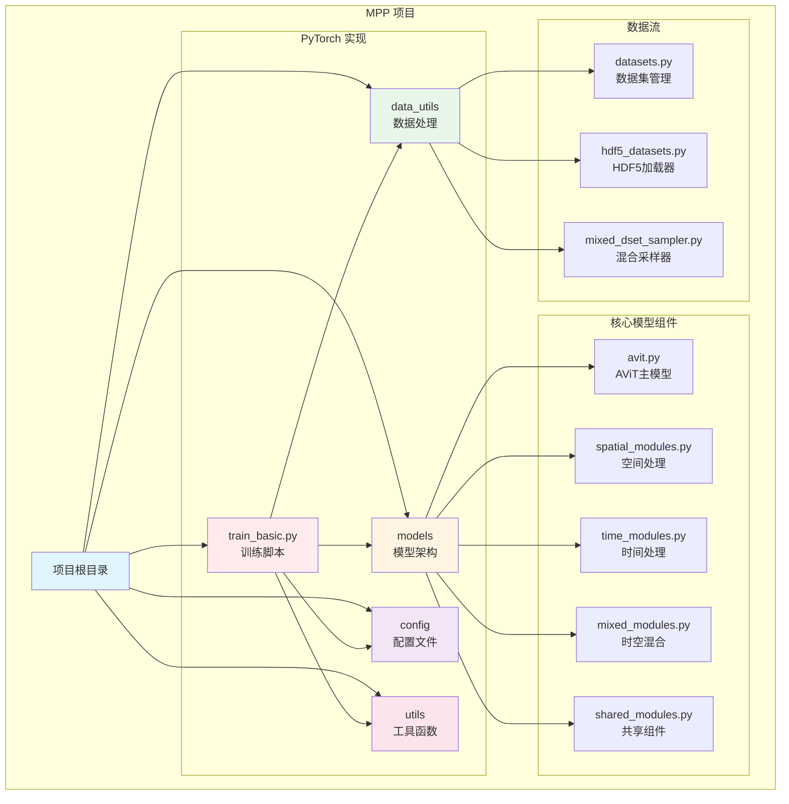

# MPP (Multiple Physics Pretraining) 项目

> **项目状态**: PyTorch 实现完成，计划迁移至 PaddlePaddle 框架
> **最后更新**: 2026-02-03
> **许可证**: MIT License

## 项目愿景

多重物理预训练（MPP）是一个用于时空代理模型的预训练策略，通过联合归一化和嵌入多组动力学数据到单一空间进行预测。该方法强制模型同时学习多种物理现象，尽管多任务学习增加了难度，但能够在多个物理问题上产生具有竞争力的结果。

### 核心特性

- **多物理联合学习**: 同时处理不同物理系统（可压缩/不可压缩流、浅水方程、扩散反应等）
- **迁移学习能力**: 预训练模型可在相对较少的样本上进行微调，实现跨物理域的知识迁移
- **AViT 架构**: 基于 Axial Vision Transformer 的时空注意力机制
- **灵活的数据处理**: 支持 HDF5 格式的 2D 时空数据集

## 项目架构概览

```
MPP/
├── multiple_physics_pretraining/    # PyTorch 实现（当前版本）
│   ├── models/                      # 模型架构
│   ├── data_utils/                  # 数据加载和处理
│   ├── config/                      # 训练配置文件
│   ├── utils/                       # 工具函数
│   └── train_basic.py              # 训练入口
└── [待创建] paddle_implementation/  # PaddlePaddle 迁移版本
```

## 模块索引

### 1. PyTorch 实现模块
- **位置**: `/home/lkyu/baidu/MPP/multiple_physics_pretraining/`
- **详细文档**: [multiple_physics_pretraining/CLAUDE.md](multiple_physics_pretraining/CLAUDE.md)
- **状态**: ✅ 完成
- **技术栈**: PyTorch 2.1, timm, einops, wandb

### 2. PaddlePaddle 迁移模块（计划中）
- **位置**: 待创建
- **状态**: 📋 规划中
- **目标**: 将 PyTorch 代码迁移至 PaddlePaddle 框架

## 全局标准

### 代码规范
- **语言**: Python 3.8+
- **代码风格**: PEP 8
- **文档字符串**: Google Style
- **类型提示**: 推荐使用但非强制

### 数据格式
- **输入格式**: HDF5 文件，形状为 `(Batch, Time, Channel, H, W)`
- **支持的数据类型**: 2D 时空序列数据
- **数据集**: PDEBench 格式

### 模型配置
- **配置格式**: YAML
- **模型规模**: Ti/S/B/L (Tiny/Small/Base/Large)
- **Patch Size**: 16x16（硬编码）

## 项目结构图



## 框架迁移计划

### 阶段 1: 准备与分析（当前阶段）
- [x] 分析 PyTorch 代码结构
- [x] 识别关键模块和依赖
- [ ] 创建 API 映射表（PyTorch → PaddlePaddle）
- [ ] 评估迁移难点和风险

### 阶段 2: 核心模块迁移
- [ ] 迁移基础模块（shared_modules）
- [ ] 迁移空间处理模块（spatial_modules）
- [ ] 迁移时间处理模块（time_modules）
- [ ] 迁移混合模块（mixed_modules）
- [ ] 迁移主模型（avit）

### 阶段 3: 数据和训练迁移
- [ ] 迁移数据加载器
- [ ] 迁移训练循环
- [ ] 迁移优化器和调度器
- [ ] 适配分布式训练

### 阶段 4: 测试与验证
- [ ] 单元测试
- [ ] 集成测试
- [ ] 性能对比测试
- [ ] 精度验证

### 阶段 5: 文档与部署
- [ ] 更新文档
- [ ] 创建迁移指南
- [ ] 提供示例和教程

## 关键技术点

### PyTorch 特有功能需要迁移
1. **DistributedDataParallel**: 需要适配 PaddlePaddle 的 `paddle.DataParallel`
2. **AMP (Automatic Mixed Precision)**: 使用 PaddlePaddle 的 `paddle.amp`
3. **自定义优化器**: DAdaptAdam, DAdaptAdan, Adan 需要重新实现或寻找替代
4. **einops**: 需要使用 PaddlePaddle 的 reshape/transpose 操作替代
5. **timm**: 部分功能需要手动实现

### 数据处理注意事项
- HDF5 读取保持不变（使用 h5py）
- 数据增强策略需要适配
- 分布式采样器需要重新实现

## 快速导航

- **PyTorch 实现详细文档**: [multiple_physics_pretraining/CLAUDE.md](multiple_physics_pretraining/CLAUDE.md)
- **原始 README**: [multiple_physics_pretraining/README.md](multiple_physics_pretraining/README.md)
- **论文链接**: [OpenReview](https://openreview.net/forum?id=DKSI3bULiZ)
- **预训练权重**: [Google Drive](https://drive.google.com/drive/folders/1Qaqa-RnzUDOO8-Gi4zlf4BE53SfWqDwx?usp=sharing)

## 贡献指南

### 当前工作重点
1. 完成 PyTorch 代码的详细分析和文档
2. 创建 PyTorch → PaddlePaddle API 映射表
3. 开始核心模块的迁移工作

### 开发流程
1. 在 PyTorch 版本中验证功能
2. 创建对应的 PaddlePaddle 实现
3. 编写单元测试确保一致性
4. 更新文档

## 联系与支持

- **论文作者**: Michael McCabe et al.
- **会议**: NeurIPS 2024
- **引用**: 见 [README.md](multiple_physics_pretraining/README.md)

---

**注意**: 本文档为项目的高层次概览。技术细节请参考各子模块的 CLAUDE.md 文档。
