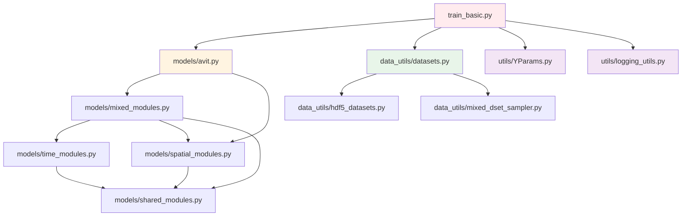

# Multiple Physics Pretraining - PyTorch 实现

> **导航**: [← 返回项目根目录](../CLAUDE.md)
> **模块路径**: `/home/lkyu/baidu/MPP/multiple_physics_pretraining/`
> **框架**: PyTorch 2.1
> **最后更新**: 2026-02-03

## 模块概述

这是 MPP 项目的 PyTorch 实现版本，包含完整的模型架构、数据处理、训练流程和配置管理。该模块实现了基于 Axial Vision Transformer (AViT) 的多物理预训练框架，能够同时学习多种物理系统的时空演化规律。

### 核心功能

- ✅ AViT 模型架构（支持 Ti/S/B/L 四种规模）
- ✅ 多数据集混合训练
- ✅ 分布式训练支持（DDP）
- ✅ 自动混合精度训练（AMP）
- ✅ 预训练和微调流程
- ✅ WandB 集成用于实验跟踪

## 目录结构

```
multiple_physics_pretraining/
├── models/                      # 模型架构模块
│   ├── avit.py                 # AViT 主模型（154 行）
│   ├── spatial_modules.py      # 空间处理模块（192 行）
│   ├── time_modules.py         # 时间处理模块（68 行）
│   ├── mixed_modules.py        # 时空混合模块（71 行）
│   └── shared_modules.py       # 共享组件（164 行）
├── data_utils/                  # 数据处理模块
│   ├── datasets.py             # 数据集管理和混合
│   ├── hdf5_datasets.py        # HDF5 数据加载器
│   └── mixed_dset_sampler.py   # 混合数据集采样器
├── config/                      # 配置文件
│   ├── mpp_avit_ti_config.yaml # Tiny 模型配置
│   ├── mpp_avit_s_config.yaml  # Small 模型配置
│   ├── mpp_avit_b_config.yaml  # Base 模型配置
│   └── mpp_avit_L_config.yaml  # Large 模型配置
├── utils/                       # 工具函数
│   ├── YParams.py              # YAML 配置解析器
│   └── logging_utils.py        # 日志工具
├── imgs/                        # 文档图片
├── train_basic.py              # 训练脚本（555 行）
├── requirements.txt            # Python 依赖
├── load_env.sh                 # 环境加载脚本
├── submit_batch.sh             # Slurm 提交脚本
├── LICENSE                     # MIT 许可证
└── README.md                   # 项目说明
```

## 接口与依赖关系

### 主要入口点

#### 1. 训练入口 (`train_basic.py`)

```python
# 命令行接口
python train_basic.py \
    --run_name <实验名称> \
    --config <配置命名空间> \
    --yaml_config <配置文件路径> \
    [--use_ddp]  # 可选：启用分布式训练
```

**关键类**: `Trainer`

- **初始化**: `__init__(params, global_rank, local_rank, device, sweep_id=None)`
- **训练**: `train()` - 主训练循环
- **单轮训练**: `train_one_epoch()` - 返回训练指标
- **验证**: `validate_one_epoch(full=False)` - 返回验证指标
- **检查点**: `save_checkpoint()`, `restore_checkpoint()`

#### 2. 模型构建 (`models/avit.py`)

```python
from models.avit import build_avit

# 从配置构建模型
model = build_avit(params)
```

**主要类**: `AViT`

- **前向传播**: `forward(x, field_labels, bcs)`
  - 输入: `x` (T, B, C, H, W), `field_labels` (B, n_states), `bcs` (边界条件)
  - 输出: 预测的下一时刻状态 (T, B, C, H, W)
- **扩展投影**: `expand_projections(expansion_amount)` - 用于微调时添加新字段
- **冻结策略**: `freeze_middle()`, `freeze_processor()`, `unfreeze()`

#### 3. 数据加载 (`data_utils/datasets.py`)

```python
from data_utils.datasets import get_data_loader

# 获取数据加载器
dataloader, dataset, sampler = get_data_loader(
    params,
    paths,  # [(路径, 数据集类型, 过滤字符串), ...]
    distributed=True,
    split='train',
    rank=0
)
```

**主要类**: `MixedDataset`

- **数据格式**: 返回 `(inp, file_index, field_labels, bcs, tar)`
- **支持的数据集**: SWE, IncompNS, CompNS, DiffRe2D

### 模块依赖图



## 关键文件详解

### 1. `train_basic.py` - 训练脚本

**职责**:

- 分布式训练设置
- 训练循环管理
- 检查点保存/加载
- 日志记录（WandB）

**关键函数**:

```python
def add_weight_decay(model, weight_decay, skip_list):
    """为不同参数组设置不同的权重衰减"""
    # 对 bias 和 scale 参数不应用权重衰减

class Trainer:
    def initialize_data(self, params):
        """初始化训练和验证数据加载器"""

    def initialize_model(self, params):
        """构建模型，支持编译和 DDP"""

    def initialize_optimizer(self, params):
        """支持 Adam, Adan, SGD 和 DAdapt 变体"""

    def initialize_scheduler(self, params):
        """余弦退火调度器，带预热"""

    def train_one_epoch(self):
        """单轮训练，支持梯度累积"""
        # 损失: NRMSE (Normalized Root Mean Square Error)
        # 指标: RMSE, NRMSE, L1

    def validate_one_epoch(self, full=False):
        """验证，按数据集类型分别计算指标"""
```

**配置参数** (通过 YAML):

- `batch_size`: 每个 GPU 的批次大小
- `accum_grad`: 梯度累积步数
- `learning_rate`: 学习率（-1 表示使用 DAdapt）
- `max_epochs`: 最大训练轮数
- `epoch_size`: 人工设定的每轮步数

### 2. `models/avit.py` - AViT 模型

**架构**:

```
输入 (T, B, C, H, W)
    ↓
SubsampledLinear (字段嵌入)
    ↓
hMLP_stem (Patch 嵌入)
    ↓
[SpaceTimeBlock] × N  (处理器块)
    ↓
hMLP_output (反 Patch 化)
    ↓
输出 (T, B, C, H, W)
```

**关键组件**:

- `SubsampledLinear`: 将不同物理字段映射到统一嵌入空间
- `hMLP_stem`: 将空间 patch 转换为 token
- `SpaceTimeBlock`: 交替进行空间和时间处理
- `hMLP_output`: 将 token 重建为空间 patch

**模型规模**:
| 模型 | embed_dim | num_heads | processor_blocks | 参数量 |
|------|-----------|-----------|------------------|--------|
| Ti | 192 | 3 | 12 | ~5M |
| S | 384 | 6 | 12 | ~22M |
| B | 768 | 12 | 12 | ~86M |
| L | 1024 | 16 | 24 | ~307M |

### 3. `models/mixed_modules.py` - 时空混合模块

**SpaceTimeBlock**:

```python
def forward(self, x, bcs):
    # x: (T, B, C, H, W)

    # 1. 时间注意力
    x = self.temporal(x)  # 保持 (T, B, C, H, W)

    # 2. 空间处理
    x = rearrange(x, 't b c h w -> (t b) c h w')
    x = self.spatial(x, bcs)
    x = rearrange(x, '(t b) c h w -> t b c h w', t=T)

    return x
```

**特性**:

- 支持梯度检查点（节省内存）
- 时间和空间模块可独立配置
- 残差连接在各子模块内部

### 4. `models/spatial_modules.py` - 空间处理

**主要组件**:

- `hMLP_stem`: Hierarchical MLP stem，将图像转换为 patch embeddings
- `hMLP_output`: 反向操作，重建图像
- `SubsampledLinear`: 稀疏线性层，用于字段嵌入
- `build_space_block()`: 工厂函数，根据配置构建空间处理块

**支持的空间处理类型**:

- `axial_attention`: 轴向注意力（沿 H 和 W 轴分别计算）
- 其他类型可扩展

### 5. `models/time_modules.py` - 时间处理

**AttentionBlock**:

```python
def forward(self, x):
    # x: (T, B, C, H, W)
    x = rearrange(x, 't b c h w -> (b h w) t c')
    x = self.attention(x)  # 标准 Transformer 注意力
    x = rearrange(x, '(b h w) t c -> t b c h w', b=B, h=H, w=W)
    return x
```

**特性**:

- 在时间维度上应用标准 Transformer 注意力
- 支持相对位置偏置（`bias_type='rel'`）
- LayerNorm + MLP + 残差连接

### 6. `models/shared_modules.py` - 共享组件

**包含**:

- `Mlp`: 标准 MLP 层
- `Attention`: 多头注意力实现
- `DropPath`: Stochastic depth
- `LayerNorm2d`: 2D LayerNorm
- 位置编码相关函数

### 7. `data_utils/datasets.py` - 数据集管理

**MixedDataset**:

```python
class MixedDataset(Dataset):
    def __init__(self, path_list, n_steps, train_val_test, split):
        # path_list: [(路径, 类型, 过滤字符串), ...]
        # 为每个路径创建子数据集

    def __getitem__(self, idx):
        # 返回: (inp, file_index, field_labels, bcs, tar)
        # inp: (B, T, C, H, W) 输入序列
        # tar: (T, B, C, H, W) 目标输出
```

**支持的数据集** (`DSET_NAME_TO_OBJECT`):

- `swe`: 浅水方程 (Shallow Water Equations)
- `incompNS`: 不可压缩 Navier-Stokes
- `compNS`: 可压缩 Navier-Stokes
- `diffre2d`: 2D 扩散反应方程

**添加新数据集**:

1. 继承 `BaseHDF5DirectoryDataset`
2. 实现 `_specifics()`, `_get_specific_stats()`, `_get_specific_bcs()`, `_reconstruct_sample()`
3. 添加到 `DSET_NAME_TO_OBJECT` 字典
4. 在配置文件中添加数据路径

### 8. `data_utils/hdf5_datasets.py` - HDF5 加载器

**BaseHDF5DirectoryDataset**:

- 从目录加载所有 HDF5 文件
- 支持训练/验证/测试划分
- 处理边界条件和归一化

**具体数据集类**:

- `SWEDataset`: 4 个字段（压力、速度 x/y、密度）
- `IncompNSDataset`: 3 个字段（速度 x/y、涡度）
- `CompNSDataset`: 4 个字段（密度、速度 x/y、压力）
- `DiffRe2DDataset`: 2 个字段（u, v）

### 9. `data_utils/mixed_dset_sampler.py` - 混合采样器

**MultisetSampler**:

```python
class MultisetSampler(Sampler):
    """确保每个 batch 从不同数据集均匀采样"""

    def __init__(self, dataset, base_sampler, batch_size,
                 distributed, max_samples, rank):
        # 为每个子数据集创建独立的采样器
        # 轮流从各数据集采样
```

**特性**:

- 支持分布式采样
- 每个 micro-batch 从单一数据集采样
- 跨数据集均匀分布

### 10. `utils/YParams.py` - 配置解析器

**YParams**:

```python
class YParams:
    """YAML 配置文件解析器"""

    def __init__(self, yaml_filename, config_name):
        # 加载指定命名空间的配置
        # 支持 YAML 锚点和引用

    def update_params(self, config):
        # 动态更新参数（用于超参数搜索）
```

### 11. `config/*.yaml` - 配置文件

**配置命名空间**:

- `basic_config`: 预训练配置
- `finetune`: 微调配置
- `frozen`: 冻结中间层的微调
- `less_frozen`: 冻结处理器的微调

**关键配置项**:

```yaml
# 模型配置
embed_dim: 768
num_heads: 12
processor_blocks: 12
n_states: 12 # 所有数据集的最大字段数

# 训练配置
batch_size: 1
accum_grad: 5 # 实际 batch size = 1 * 5 = 5
learning_rate: -1 # 使用 DAdapt
optimizer: "adan"
max_epochs: 500

# 数据配置
n_steps: 16 # 输入序列长度
train_data_paths:
  - ["~/PDEBench/2D/shallow-water", "swe", ""]
  - ["~/PDEBench/2D/NS_incom", "incompNS", ""]
  # ...
```

## 数据流

### 训练数据流


### 前向传播流程

```python
# 1. 数据准备
inp, file_index, field_labels, bcs, tar = batch
# inp: (B, T, C, H, W)
# tar: (T, B, C, H, W)

inp = rearrange(inp, 'b t c h w -> t b c h w')

# 2. 模型前向
output = model(inp, field_labels, bcs)
# output: (T, B, C, H, W)

# 3. 损失计算
residuals = output - tar
tar_norm = tar.pow(2).mean(spatial_dims, keepdim=True)
loss = (residuals.pow(2).mean(spatial_dims, keepdim=True) / tar_norm).mean()

# 4. 反向传播
loss.backward()
optimizer.step()
```

## 测试与验证

### 单元测试

目前项目没有独立的测试文件，建议添加：

```
tests/
├── test_models.py          # 模型组件测试
├── test_data_utils.py      # 数据加载测试
└── test_training.py        # 训练流程测试
```

### 验证流程

```python
# 在 validate_one_epoch() 中
for subset in valid_dataset.sub_dsets:
    # 为每个数据集创建独立的 DataLoader
    # 计算数据集特定的指标
    logs[f'{dset_type}/valid_nrmse'] = ...
    logs[f'{dset_type}/{field_name}_valid_nrmse'] = ...
```

### 指标

- **NRMSE**: Normalized Root Mean Square Error
- **RMSE**: Root Mean Square Error
- **L1**: Mean Absolute Error

## 依赖项

### Python 包 (`requirements.txt`)

```
torch==2.1              # 深度学习框架
timm==0.9.5            # 模型组件库
einops==0.7            # 张量操作
h5py==3.9.0            # HDF5 文件读取
numpy==1.25.2          # 数值计算
wandb==0.15.8          # 实验跟踪
tqdm==4.66.0           # 进度条
zarr==2.16.1           # 数组存储
ruamel.yaml==0.17.32   # YAML 解析
adan-pytorch==0.1.0    # Adan 优化器
dadaptation==3.1       # DAdapt 优化器
torchinfo==1.8.0       # 模型信息
```

### 外部依赖

- **CUDA**: 用于 GPU 加速
- **NCCL**: 用于分布式训练
- **Slurm** (可选): 用于集群任务调度

## 使用示例

### 1. 预训练

```bash
# 单 GPU 训练
python train_basic.py \
    --run_name pretrain_exp1 \
    --config basic_config \
    --yaml_config ./config/mpp_avit_b_config.yaml

# 多 GPU 分布式训练（Slurm）
sbatch submit_batch.sh
```

### 2. 微调

```bash
# 修改配置文件
# 1. 设置 pretrained: True
# 2. 设置 pretrained_ckpt_path
# 3. 配置 train_data_paths 为目标数据集
# 4. 设置 append_datasets（如果添加新字段）

python train_basic.py \
    --run_name finetune_exp1 \
    --config finetune \
    --yaml_config ./config/mpp_avit_b_config.yaml
```

### 3. 添加新数据集

```python
# 1. 在 hdf5_datasets.py 中定义新类
class NewDataset(BaseHDF5DirectoryDataset):
    @staticmethod
    def _specifics():
        return (
            'new_dataset',  # 类型名称
            ['field1', 'field2'],  # 字段名称
            4  # 字段数量
        )

    def _get_specific_stats(self, data):
        # 返回归一化统计量
        pass

    def _get_specific_bcs(self, data):
        # 返回边界条件
        pass

    def _reconstruct_sample(self, data):
        # 重建样本格式
        pass

# 2. 在 datasets.py 中注册
DSET_NAME_TO_OBJECT['new_dataset'] = NewDataset

# 3. 在配置文件中添加路径
train_data_paths:
  - ['/path/to/data', 'new_dataset', '']
```

## 性能优化

### 内存优化

- **梯度累积**: `accum_grad > 1` 减少内存占用
- **梯度检查点**: `gradient_checkpointing: True` 牺牲速度换内存
- **混合精度**: `enable_amp: True` 使用 FP16/BF16

### 速度优化

- **编译**: `compile: True` 使用 `torch.compile()`（实验性）
- **数据加载**: 调整 `num_data_workers`
- **分布式**: 使用 DDP 多 GPU 训练

### 训练技巧

- **学习率**: 使用 DAdapt (`learning_rate: -1`) 自动调整
- **优化器**: Adan 在实验中表现最好
- **调度器**: 余弦退火 + 预热
- **权重衰减**: 对 bias 和 scale 参数不应用

## 常见问题

### 1. 内存不足

- 减小 `batch_size`
- 增加 `accum_grad`
- 启用 `gradient_checkpointing`
- 减小 `n_steps`

### 2. 训练不稳定

- 检查学习率设置
- 启用梯度裁剪（已默认启用，阈值为 1）
- 检查数据归一化

### 3. 分布式训练问题

- 确保 `WORLD_SIZE`, `RANK`, `LOCAL_RANK` 环境变量正确
- 检查 NCCL 配置
- 验证网络连接

### 4. 数据加载慢

- 增加 `num_data_workers`
- 使用 SSD 存储数据
- 预处理数据到更快的格式

## 迁移到 PaddlePaddle 的注意事项

### 需要替换的组件

1. **模型层**
   - `nn.Module` → `paddle.nn.Layer`
   - `nn.Linear` → `paddle.nn.Linear`
   - `nn.LayerNorm` → `paddle.nn.LayerNorm`
   - `nn.MultiheadAttention` → `paddle.nn.MultiHeadAttention`

2. **张量操作**
   - `torch.tensor` → `paddle.to_tensor`
   - `einops.rearrange` → 使用 `paddle.reshape` + `paddle.transpose`
   - `torch.cuda.amp` → `paddle.amp`

3. **优化器**
   - `optim.AdamW` → `paddle.optimizer.AdamW`
   - DAdapt 和 Adan 需要重新实现或寻找替代

4. **分布式**
   - `DistributedDataParallel` → `paddle.DataParallel`
   - `dist.init_process_group` → `paddle.distributed.init_parallel_env`

5. **数据加载**
   - `torch.utils.data.Dataset` → `paddle.io.Dataset`
   - `torch.utils.data.DataLoader` → `paddle.io.DataLoader`
   - `DistributedSampler` → `paddle.io.DistributedBatchSampler`

### API 映射表（部分）

| PyTorch                             | PaddlePaddle                               | 注意事项       |
| ----------------------------------- | ------------------------------------------ | -------------- |
| `torch.nn.Module`                   | `paddle.nn.Layer`                          | 基类不同       |
| `torch.optim.AdamW`                 | `paddle.optimizer.AdamW`                   | API 基本一致   |
| `torch.cuda.amp.autocast`           | `paddle.amp.auto_cast`                     | 参数略有不同   |
| `torch.nn.functional.gelu`          | `paddle.nn.functional.gelu`                | 一致           |
| `torch.utils.checkpoint.checkpoint` | `paddle.distributed.fleet.utils.recompute` | 名称和用法不同 |

### 迁移优先级

1. **高优先级**（核心功能）
   - `models/shared_modules.py` - 基础组件
   - `models/spatial_modules.py` - 空间处理
   - `models/time_modules.py` - 时间处理
   - `models/avit.py` - 主模型

2. **中优先级**（训练支持）
   - `data_utils/` - 数据加载
   - `train_basic.py` - 训练循环

3. **低优先级**（辅助功能）
   - `utils/` - 工具函数
   - 配置和脚本

## 相关资源

- **论文**: [Multiple Physics Pretraining for Spatiotemporal Surrogate Models](https://openreview.net/forum?id=DKSI3bULiZ)
- **预训练权重**: [Google Drive](https://drive.google.com/drive/folders/1Qaqa-RnzUDOO8-Gi4zlf4BE53SfWqDwx?usp=sharing)
- **PDEBench 数据集**: [GitHub](https://github.com/pdebench/PDEBench)
- **原始 README**: [README.md](README.md)

## 下一步工作

### 短期目标

- [ ] 添加单元测试
- [ ] 完善文档字符串
- [ ] 创建 PyTorch → PaddlePaddle API 映射表
- [ ] 验证模型输出一致性

### 中期目标

- [ ] 开始核心模块迁移
- [ ] 实现 PaddlePaddle 版本的自定义优化器
- [ ] 适配分布式训练

### 长期目标

- [ ] 完成完整迁移
- [ ] 性能对比测试
- [ ] 精度验证
- [ ] 发布 PaddlePaddle 版本

---

**维护者**: 待定
**最后审查**: 2026-02-03
**版本**: 1.0.0 (PyTorch)
